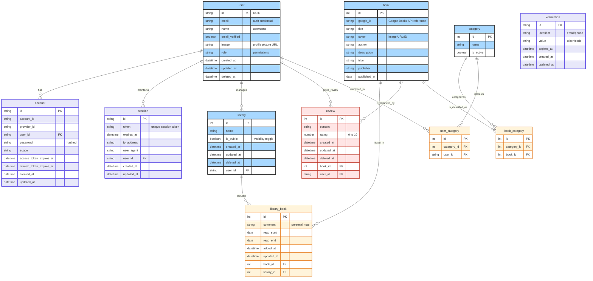

# ERD

Legend :

- Blue - MVP
- Orange - Table Pivot
- Red - Evolutions
- Purple - Better-Auth

```mermaid
erDiagram
    %% Legend: Blue = MVP | Orange = Pivot | Red = Evolutions | Purple = Better-Auth
    
    user ||--o{ account : has
    user ||--o{ session : maintains
    user ||--o{ library : manages
    library ||--o{ library_book : includes
    book ||--o{ library_book : listed_in
    user ||--o{ review: gives_review
    book ||--o{ review: is_reviewed_by
    book ||--|{ book_category : is_classified_as
    category ||--o{ book_category : categorizes
    category ||--o{ user_category : interests
    user ||--o{ user_category : interested_in

    %% Better-Auth Tables
    user {
        string id PK "UUID"
        string email "auth credential"
        string name "username"
        boolean email_verified
        string image "profile picture URL"
        string role "permissions"
        datetime created_at
        datetime updated_at
        datetime deleted_at
    }

    account {
        string id PK
        string account_id
        string provider_id
        string user_id FK
        string password "hashed"
        string scope
        datetime access_token_expires_at
        datetime refresh_token_expires_at
        datetime created_at
        datetime updated_at
    }

    session {
        string id PK
        string token "unique session token"
        datetime expires_at
        string ip_address
        string user_agent
        string user_id FK
        datetime created_at
        datetime updated_at
    }

    verification {
        string id PK
        string identifier "email/phone"
        string value "token/code"
        datetime expires_at
        datetime created_at
        datetime updated_at
    }

    %% MVP Business Tables
    library {
        int id PK
        string name
        boolean is_public "visibility toggle"
        datetime created_at
        datetime updated_at
        datetime deleted_at
        string user_id FK
    }

    library_book {
        int id PK
        string comment "personal note"
        date read_start
        date read_end
        datetime added_at
        datetime updated_at
        int book_id FK
        int library_id FK
    }

    book {
        int id PK
        string google_id "Google Books API reference"
        string title
        string cover "image URL/ID"
        string author
        string description
        string isbn
        string publisher
        date published_at
    }

    category {
        int id PK
        string name
        boolean is_active
    }

    %% Pivot Tables
    book_category {
        int id PK
        int category_id FK
        int book_id FK
    }

    user_category {
        int id PK
        int category_id FK
        string user_id FK
    }

    %% Evolutions
    review {
        int id PK
        string content
        number rating "0 to 10"
        datetime created_at
        datetime updated_at
        datetime deleted_at
        int book_id FK
        string user_id FK
    }

    classDef auth fill:#E8E8FA,stroke:#6C5CE7,stroke-width:2px
    classDef entity fill:#A8D8FF,stroke:#333,stroke-width:2px
    classDef pivot fill:#fff4db,stroke:#e67e22,stroke-width:1px
    classDef evolution fill:#ffe5e5,stroke:#c0392b,stroke-width:1px

    class account,session,verification auth
    class user,library,book,category entity
    class user_category,book_category,library_book pivot
    class review evolution
```