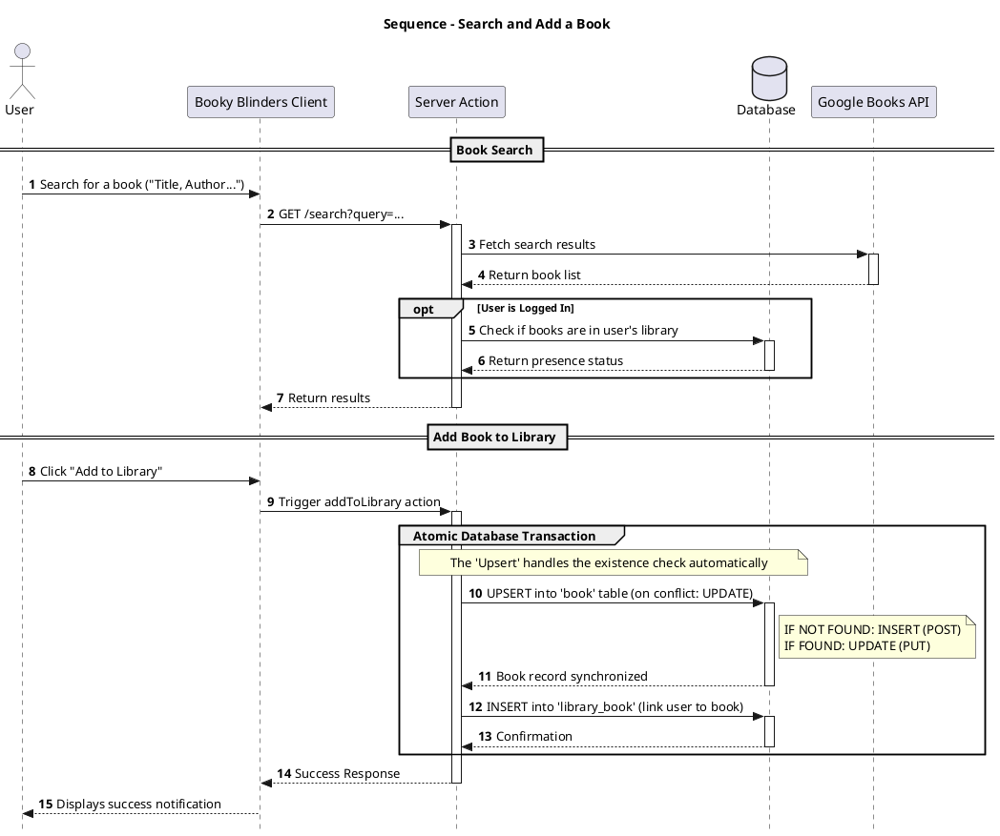

# SEQUENCE DIAGRAM

```plantuml
@startuml
title Sequence - Search and Add a Book

autonumber
skinparam style strictuml

actor User
participant "Booky Blinders Client" as Client
participant "Server Action" as Server
database "Database" as DB
participant "Google Books API" as API

== Book Search ==

User -> Client : Search for a book ("Title, Author...")
Client -> Server : GET /search?query=...
activate Server

Server -> API : Fetch search results
activate API
API --> Server : Return book list
deactivate API

opt User is Logged In
    Server -> DB : Check if books are in user's library
    activate DB
    DB --> Server : Return presence status
    deactivate DB
end

Server --> Client : Return results
deactivate Server

== Add Book to Library ==

User -> Client : Click "Add to Library"
Client -> Server : Trigger addToLibrary action
activate Server

group Atomic Database Transaction
    note over Server, DB : The 'Upsert' handles the existence check automatically
    
    Server -> DB : UPSERT into 'book' table (on conflict: UPDATE)
    activate DB
    note right of DB : IF NOT FOUND: INSERT (POST)\nIF FOUND: UPDATE (PUT)
    DB --> Server : Book record synchronized
    deactivate DB

    Server -> DB : INSERT into 'library_book' (link user to book)
    activate DB
    DB --> Server : Confirmation
    deactivate DB
end

Server --> Client : Success Response
deactivate Server

Client --> User : Displays success notification

@enduml
```
