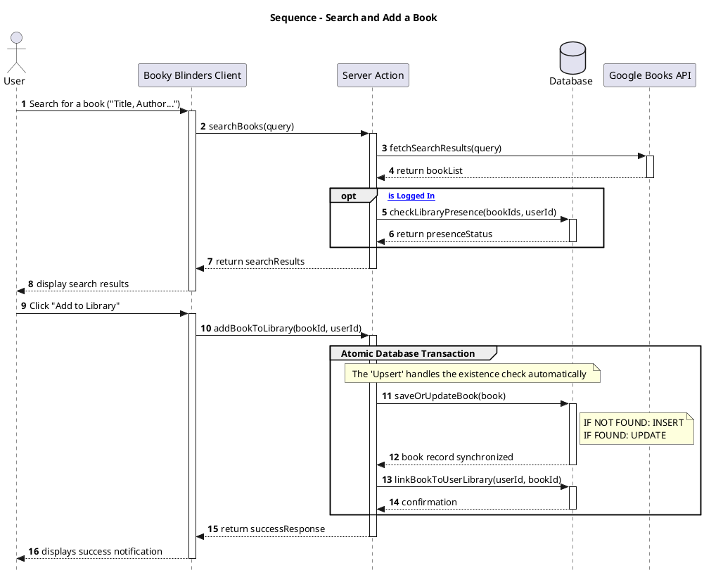

# SEQUENCE DIAGRAM

```plantuml
@startuml
title Sequence - Search and Add a Book

autonumber
skinparam style strictuml

actor User
participant "Booky Blinders Client" as Client
participant "Server Action" as Server
database "Database" as DB
participant "Google Books API" as API

User -> Client : Search for a book ("Title, Author...")
activate Client

Client -> Server : searchBooks(query)
activate Server

Server -> API : fetchSearchResults(query)
activate API
API --> Server : return bookList
deactivate API

opt [User is Logged In]
    Server -> DB : checkLibraryPresence(bookIds, userId)
    activate DB
    DB --> Server : return presenceStatus
    deactivate DB
end

Server --> Client : return searchResults
deactivate Server

Client --> User : display search results
deactivate Client


User -> Client : Click "Add to Library"
activate Client

Client -> Server : addBookToLibrary(bookId, userId)
activate Server

group Atomic Database Transaction
    note over Server, DB : The 'Upsert' handles the existence check automatically
    
    Server -> DB : saveOrUpdateBook(book)
    activate DB
    note right of DB : IF NOT FOUND: INSERT\nIF FOUND: UPDATE
    DB --> Server : book record synchronized
    deactivate DB

    Server -> DB : linkBookToUserLibrary(userId, bookId)
    activate DB
    DB --> Server : confirmation
    deactivate DB
end

Server --> Client : return successResponse
deactivate Server

Client --> User : displays success notification
deactivate Client

@enduml
```
