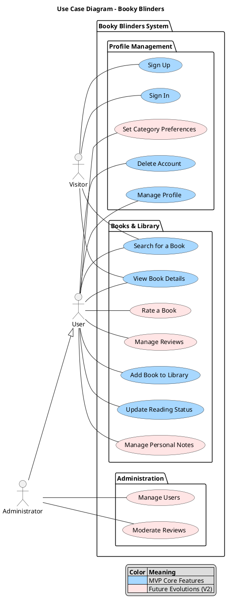

# USE CASE DIAGRAM

```plantuml
@startuml
title Use Case Diagram - Booky Blinders

left to right direction

' Actor Definitions
actor "Visitor" as V
actor "User" as U
actor "Administrator" as A

package "Booky Blinders System" {
    
    package "Profile Management" {
        usecase UC1 as "Sign Up" #A8D8FF
        usecase UC2 as "Sign In" #A8D8FF
        usecase UC3 as "Manage Profile" #A8D8FF
        usecase UC4 as "Set Category Preferences" #FFE5E5
        usecase UC5 as "Delete Account" #A8D8FF
    }
    
    package "Books & Library" {
        usecase UC6 as "Search for a Book" #A8D8FF
        usecase UC7 as "View Book Details" #A8D8FF
        usecase UC8 as "Add Book to Library" #A8D8FF
        usecase UC9 as "Update Reading Status" #A8D8FF
        usecase UC10 as "Manage Personal Notes" #FFE5E5
        usecase UC11 as "Rate a Book" #FFE5E5
        usecase UC12 as "Manage Reviews" #FFE5E5
    }
    
    package "Administration" {
        usecase UC13 as "Manage Users" #FFE5E5
        usecase UC14 as "Moderate Reviews" #FFE5E5
    }
}

' Actor Relationships
V -- UC1
V -- UC2
V -- UC6
V -- UC7

U -- UC6
U -- UC7
U -- UC3
U -- UC4
U -- UC5
U -- UC8
U -- UC9
U -- UC10
U -- UC11
U -- UC12

A --|> U
A -- UC13
A -- UC14

' Legend
legend right
  |= Color |= Meaning |
  |<#A8D8FF>| MVP Core Features |
  |<#FFE5E5>| Future Evolutions (V2) |
endlegend

@enduml
```